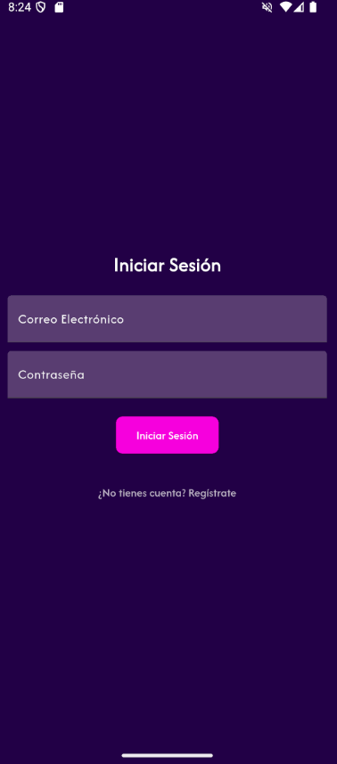
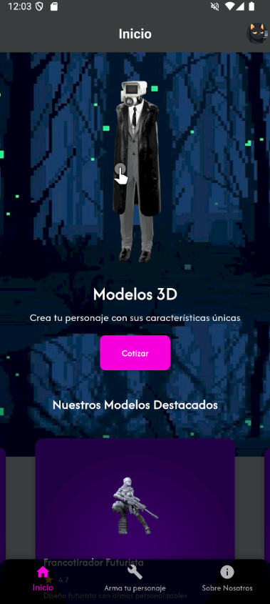
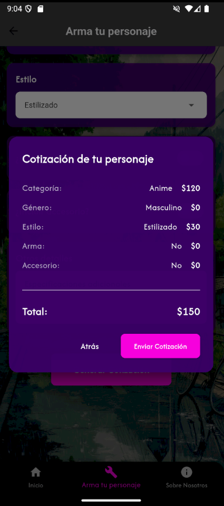
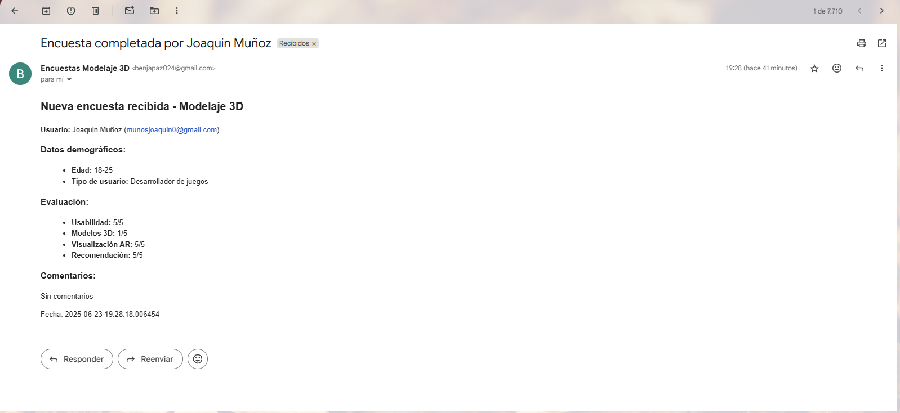
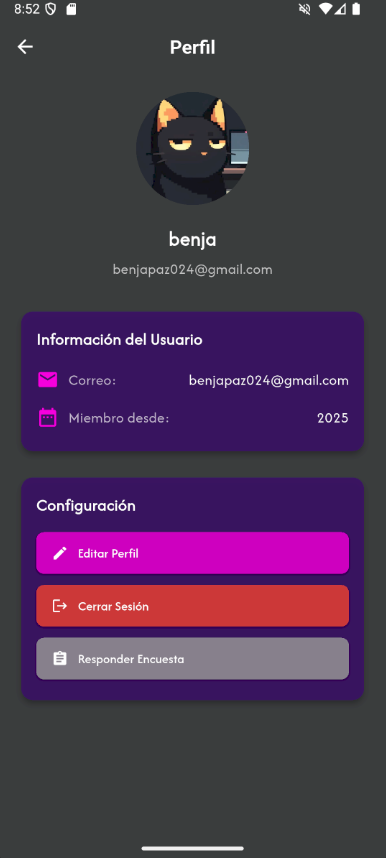
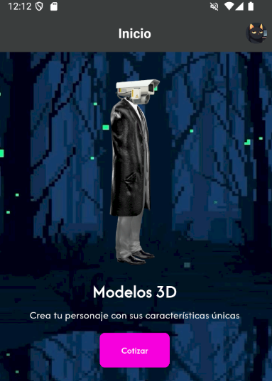
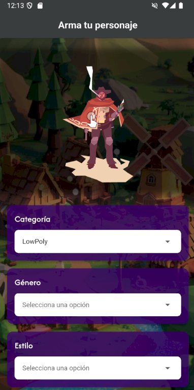
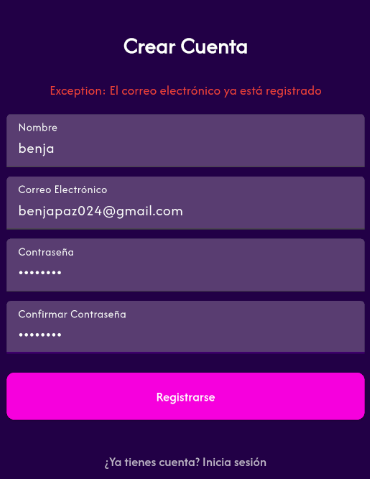
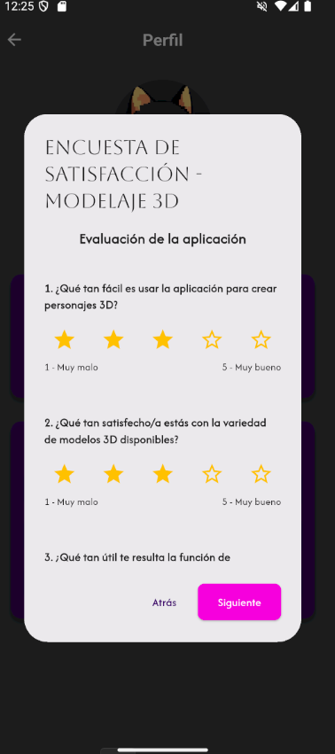
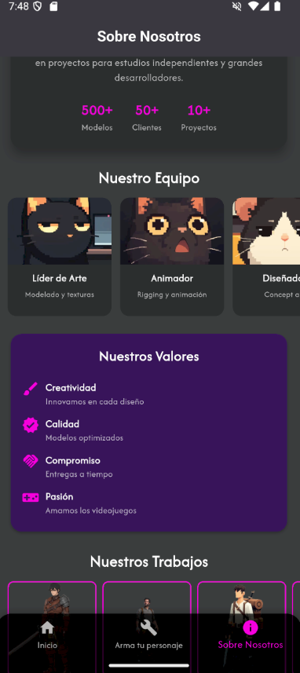

# Ize
## Servicios para modelaje para personajes de videojuegos en 3D

**IZE** es una aplicación móvil para el modelaje y cotización de personajes 3D para videojuegos.

## Lista de Requerimientos y Funcionalidades Principales

### ✅ Funcionalidades Implementadas

#### **Sistema de Autenticación**
- [x] Registro de nuevos usuarios
- [x] Inicio de sesión seguro
- [x] Gestión de sesiones

#### **Sistema de Cotización**
- [x] Formulario de solicitud de cotización personalizado
- [x] Cálculo automático de precios según especificaciones
- [x] Envío automático de cotizaciones por correo electrónico

#### **Gestión de Perfil de Usuario**
- [x] Edición de información personal
- [x] Gestión de estado con Provider

#### **Base de Datos y Persistencia**
- [x] Implementación de SQLite para almacenamiento local
- [x] Operaciones CRUD completas (Crear, Leer, Actualizar, Eliminar)
- [x] Clases de entidad para modelos de datos
- [x] Clases de utilidad para gestión de base de datos

#### **Navegación y Interfaz**
- [x] Bottom Navigation Bar para navegación principal
- [x] Diseño coherente con Material Design
- [x] Tema personalizado de la aplicación
- [x] Icono personalizado y splash screen

#### **Sistema de Valoración y Feedback**
- [x] Encuesta de valoración cargada desde JSON
- [x] Evaluación en categorías: Usabilidad, Contenido, Compartir
- [x] Envío de retroalimentación por correo electrónico

#### **Realidad Aumentada**
- [x] Visualización de modelos 3D en AR
- [x] Integración con ARCore/ARKit
- [x] Interacción con modelos en tiempo real

#### **Preferencias del Usuario**
- [x] Pantalla de configuración de preferencias
- [x] Almacenamiento de configuraciones personalizadas

#### **Servicios del Sistema Operativo**
- [x] Integración con cliente de correo electrónico
- [x] Almacenamiento local de datos
- [x] Compartir información con otras aplicaciones
- [x] Conexion a internet

## Arquitectura Técnica

### **Frontend**
- **Framework:** Flutter
- **Lenguaje:** Dart
- **Diseño:** Material Design

### **Gestión de Estado**
- **Provider:** Para manejo de estado global
- **Notificación de cambios:** En tiempo real

### **Base de Datos**
- **Motor:** SQLite
- **Package:** sqflite
- **Características:** Relacional, local, persistente

### **Servicios Integrados**
- **Email:** Intent para aplicaciones de correo
- **AR:** ARCore (Android) / ARKit (iOS)
- **Almacenamiento:** Shared Preferences + SQLite

## Instalación

### **Instalación desde APK**
1. Descargar el archivo APK desde el enlace proporcionado
2. Habilitar "Instalación desde fuentes desconocidas" en Configuración > Seguridad
3. Ejecutar el archivo APK descargado
4. Seguir las instrucciones de instalación

## Capturas de Pantalla

### Pantalla de Inicio y Autenticación

*Pantalla de inicio de sesión con validación de credenciales*

*Pantalla principal con navegación a funcionalidades principales*

### Sistema de Cotización

*Formulario de solicitud de cotización personalizada*

*Ejemplo de cotización enviada por correo electrónico*

### Gestión de Perfil

*Pantalla de perfil de usuario con opciones de edición*

*Configuración de preferencias personalizadas*

### Realidad Aumentada

*Visualización de modelo 3D en realidad aumentada*

*Interacción con modelo 3D en entorno real*

### Base de Datos y CRUD

*Operaciones de base de datos en funcionamiento*

### Sistema de Valoración

*Encuesta de valoración cargada desde JSON*

*Pantalla "Acerca de" con información del desarrollador*

## Validación de Usuarios

### **Metodología de Validación**
La aplicación fue validada mediante un proceso de beta cerrada con 6 usuarios distribuidos en 3 categorías:

- **2 Desarrolladores de proyectos:** Profesionales trabajando en sus propios proyectos de desarrollo
- **2 Profesionales del área:** Expertos en diseño 3D y desarrollo de videojuegos  
- **2 Usuarios no técnicos:** Personal externo sin conocimientos técnicos de programación

### **Instrumento de Validación**
Se utilizó una encuesta estructurada con 9 preguntas distribuidas en 3 categorías:
- **Usabilidad:** Facilidad de navegación y completitud de tareas
- **Contenido:** Utilidad y relevancia del contenido presentado
- **Compartir:** Disposición a recomendar la aplicación

### **Resultados de Validación**
- **Navegación e Usabilidad:** 4.3/5.0 promedio
- **Contenido y Utilidad:** 4.5/5.0 promedio
- **Disposición a Recomendar:** 4.2/5.0 promedio

## Descargas

### 📱 **Archivo APK**
**[Descargar 3D Character Forge APK](./build/app/outputs/apk/release/app-release.apk)**

*Versión: 1.0.0 | Tamaño: ~45 MB | Compatible con Android 7.0+*

### 🎥 **Video Explicativo**
**[Ver Video de Demostración]**

*Duración: 5 minutos | Incluye demo completo de funcionalidades*

## Información del Desarrollador

- **Desarrollador:** [Benjamin Paz Pasten]
- **Email:** [benjapaz024@gmail.com]
- **Proyecto:** proyecto 2
- **Institución:** [Universidad de Talca]
- **Fecha:** Junio 2025